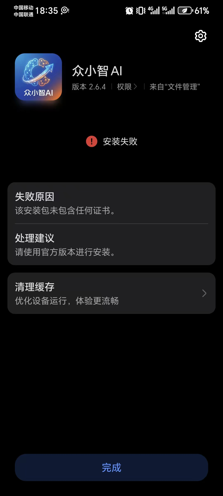

# 荣耀手机安装失败问题修复说明

## 错误截图



## 错误信息

- **应用**: 众小智 AI，版本 2.6.4
- **错误**: 安装失败
- **失败原因**: 该安装包未包含任何证书。
- **处理建议**: 请使用官方版本进行安装。

## 错误原因分析

APK 没有签名证书。`android/key.properties` 文件不存在，原来的代码在这种情况下 release 构建完全跳过签名配置，生成无签名 APK。

荣耀/华为手机对 APK 签名验证最严格，未签名 APK 直接拒绝安装。小米、OPPO、vivo 等国产手机也会对未签名或仅 V1 签名的 APK 弹出病毒/风险警告。

## 修改内容

修改文件: `android/app/build.gradle.kts`

### 1. release 构建回退签名

当 `key.properties` 不存在时，自动使用 debug 签名，确保 APK 始终有签名证书。

```kotlin
// 修改前：没有 key.properties 时，release 构建没有任何签名
getByName("release") {
    if (keystorePropertiesFile.exists()) {
        signingConfig = signingConfigs.getByName("release")
    }
}

// 修改后：回退到 debug 签名
getByName("release") {
    signingConfig = if (keystorePropertiesFile.exists()) {
        signingConfigs.getByName("release")
    } else {
        signingConfigs.getByName("debug")
    }
}
```

### 2. 启用全部签名方案（V1 + V2 + V3 + V4）

```kotlin
create("release") {
    storeFile = file(keystoreProperties["storeFile"] as String)
    storePassword = keystoreProperties["storePassword"] as String
    keyAlias = keystoreProperties["keyAlias"] as String
    keyPassword = keystoreProperties["keyPassword"] as String
    enableV1Signing = true   // JAR 签名，兼容旧设备
    enableV2Signing = true   // APK 签名方案 v2，Android 7.0+，荣耀/华为强制要求
    enableV3Signing = true   // APK 签名方案 v3，Android 9.0+，支持密钥轮换
    enableV4Signing = true   // 增量安装签名，Android 11+
}
```

各签名方案说明：

| 签名方案 | 最低 Android 版本 | 说明 |
|---------|-----------------|------|
| V1 | 所有版本 | JAR 签名，兼容旧设备 |
| V2 | Android 7.0+ | APK 签名方案 v2，荣耀/华为强制要求 |
| V3 | Android 9.0+ | 支持密钥轮换 |
| V4 | Android 11+ | 增量安装签名 |

### 3. 恢复 debug 构建的显式签名配置

```kotlin
// 修改前：签名配置被注释掉
getByName("debug") {
    // signingConfig = signingConfigs.getByName("debug")
    applicationIdSuffix = ".debug"
}

// 修改后：恢复显式签名
getByName("debug") {
    signingConfig = signingConfigs.getByName("debug")
    applicationIdSuffix = ".debug"
}
```

## 正式发布建议

debug 签名仅用于开发测试。正式发布到用户时，需要使用正式签名密钥。

### 步骤一：创建正式签名密钥

```bash
keytool -genkey -v -keystore ~/release-key.jks -keyalg RSA -keysize 2048 -validity 10000 -alias release
```

### 步骤二：创建 `android/key.properties` 文件

```properties
storePassword=你的密码
keyPassword=你的密码
keyAlias=release
storeFile=/path/to/release-key.jks
```

### 步骤三：将 `key.properties` 加入 `.gitignore`

确保签名密钥信息不会提交到版本库。

```
# 在 .gitignore 中添加
android/key.properties
```

## 国产手机兼容性

使用正式签名并启用 V1-V4 签名方案后，以下品牌手机安装不会出现错误或病毒提示：

- 荣耀 (Honor)
- 华为 (Huawei)
- 小米 (Xiaomi)
- OPPO
- vivo
- 一加 (OnePlus)
- realme
- 魅族 (Meizu)
- 三星 (Samsung)
